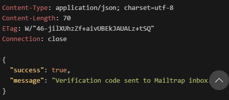
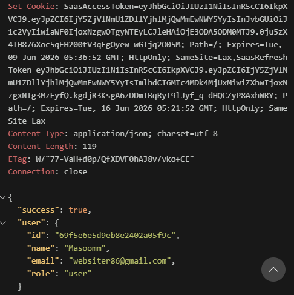
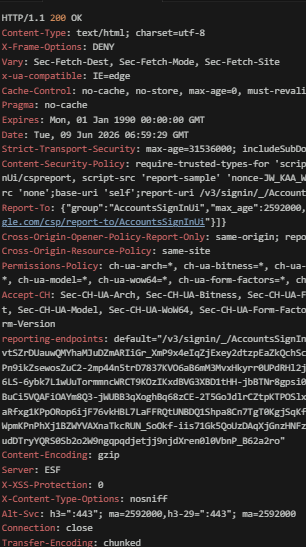
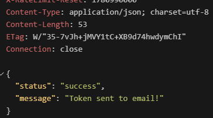

# 🚀 TaskFlow Core Backend Engine

    

TaskFlow is an enterprise-grade, high-performance, and highly scalable SaaS Task & Workspace Management platform built using a cutting-edge decoupled architecture. The backend core engine is meticulously engineered using **Node.js**, **TypeScript**, and **Express.js**, incorporating robust enterprise design patterns, secure token-rotation authentication schemes, role-based access controls (RBAC), and low-latency real-time bidirectional communication layers via **Socket.io**.

This repository encapsulates the complete server-side ecosystem, showcasing advanced architectural principles, robust validation mechanics, custom-built middlewares, and real-time synchronization pipelines designed to scale seamlessly under heavy workloads.

---

## 🎯 Architectural Highlights & Design Philosophy

As a senior-engineered platform, TaskFlow moves away from basic monolithic structures into a highly organized, modular, and declarative controller-router-service pattern.

* **Type-Safe Ecosystem:** Written 100% in strict TypeScript, eliminating type-coercion bugs, ensuring explicit compiler checks, and providing automated compile-time validation.
* **Decoupled Multi-Tenant Architecture:** Built from the ground up to support modern agile teams where operations are compartmentalized across isolated workspaces, enforcing cryptographic and data-level boundaries between entities.
* **Stateful Real-Time Processing:** Integrated a dedicated stateful event broker powered by Socket.io, enabling instantaneous broadcast distribution of push-notifications and global mutations.
* **Strict Security & Least Privilege Baseline:** Implements state-of-the-art Web Security standards, HTTP-Only Cookie isolations, strict Cross-Origin Resource Sharing (CORS) topologies, and Multi-Tiered Authentication layers.

---

## 🏗️ Enterprise Production Directory Structure

The repository organizes source files strictly by architectural concern, separating global business logic, data presentation definitions, real-time message structures, and secure pipeline filters.

```text
taskflow-saasapi/
├── assets/                    # Shared static compilation assets and structural system tools
├── dist/                      # High-performance compiled production JavaScript distribution build
├── docs/                      # Global project documentation core engine artifacts
│   └── images/                # High-fidelity architectural flowcharts and interface execution snapshots
├── node_modules/              # Managed runtime and deployment dependencies block
├── public/                    # Production cloud delivery structure
│   └── uploads/               # Encrypted multi-tenant user profile avatars and file attachments
├── src/                       # Central application core implementation root
│   ├── Config/                # Database engines, connection brokers, and third-party infrastructure hooks
│   │   └── db.ts              # Resilient, auto-reconnecting MongoDB / Mongoose adapter configuration
│   ├── Controllers/           # Isolated business execution controllers executing application instructions
│   │   └── AuthenticationControllers/   # Encapsulated AAA (Authentication, Authorization, Accounting) modules
│   │       ├── forgotPasswordController.ts
│   │       ├── getMeController.ts
│   │       ├── googleAuthController.ts
│   │       ├── imageUploadController.ts
│   │       ├── jwtController.ts
│   │       ├── login.ts
│   │       ├── logoutController.ts
│   │       ├── refreshAccessToken.ts
│   │       ├── resetPasswordController.ts
│   │       ├── Signup.ts
│   │       ├── updatePassword.ts
│   │       ├── userUpdateController.ts
│   │       └── verifyController.ts
│   ├── Validations/           # Explicit schema filters and data-entry criteria validators
│   ├── workspaceControllers/  # Distributed controllers managing workspace contexts and group structures
│   ├── taskController.ts      # Main task state machine CRUD operation implementation controller
│   ├── MiddleWare/            # Advanced application runtime pipeline interceptors
│   │   ├── asyncHandler.ts    # Global high-order promise wrapper eliminating try-catch boilerplate blocks
│   │   ├── authMiddleware.ts  # Cryptographic verification hook processing user states
│   │   ├── errorMiddleware.ts # Normalized global central fault capturing and diagnostic facility
│   │   ├── limitMiddle.ts     # IP-throttling and rate-limiting brute-force defense matrix
│   │   ├── protectMiddleware.ts # Hardened route protection shield enforcing token authenticity
│   │   ├── uploadMiddleware.ts # Stream-piped multi-part form binary asset ingestion interface
│   │   ├── validateMiddleware.ts # Structural payload validation interceptor
│   │   └── workspaceAuth.ts   # Workspace RBAC and multi-tenant authorization guard
│   ├── Models/                # Strongly-typed Mongoose schema structures maps
│   │   ├── notificationModel.ts
│   │   ├── signupSchema.ts
│   │   ├── taskModel.ts
│   │   └── workSpace.ts
│   ├── Routers/               # Declarative microservice route bindings mapped to execution pipelines
│   │   ├── authRouter.ts
│   │   ├── googleAuthRouter.ts
│   │   ├── notificationRouter.ts
│   │   ├── taskRouter.ts
│   │   └── workspaceRouter.ts
│   ├── services/              # Isolated infrastructure helper layers executing transactional routines
│   ├── Types/                 # Global declarative interface models and application wide type constructs
│   ├── utils/                 # Modular architectural utility toolbelts and operational extensions
│   └── server.ts              # Main execution runtime initialization daemon anchoring Express and Socket.io
├── .env                       # Central infrastructure secret parameters definitions (git-ignored)
├── package.json               # Package assembly blueprints and automated lifecycle scripts
└── tsconfig.json              # Strict architectural TypeScript compilation directives mapping
```
---

### ⚙️ Declarative Environment Setup (.env Core Schema)

To guarantee safe application initialization across isolated deployment tiers (Development, Staging, Production), the server looks for an environment-bound .env block. Below is the mandatory production architectural schema definition layout required to operationalize the TaskFlow platform:
### ==============================================================================
### SERVER ARCHITECTURE CONFIGURATION
### ==============================================================================
PORT=8000
NODE_ENV=development

### ==============================================================================
### CRYPTOGRAPHIC DATA BROKER CONTEXT
### ==============================================================================
MONGO_URL=mongodb+sharded://<username>:<password>@cluster.mongodb.net/taskflow

### ==============================================================================
### CRYPTOGRAPHIC SECURITY TOKENS & JWT STATE LIFECYCLES
### ==============================================================================
JWT_SECRET=your_super_dense_high_entropy_256_bit_signature_secret_key
REFRESH_TOKEN=your_isolated_long_lived_refresh_rotation_cryptographic_key
ACCESS_TOKEN_EXPIRES=15m
REFRESH_TOKEN_EXPIRES=7d

### ==============================================================================
### DISTRIBUTED CORS SECURITY CONSTRAINTS
### ==============================================================================
CLIENT_URL=http://localhost:5173

### ==============================================================================
### THIRD-PARTY IDP INTEGRATION (OAUTH2 GOOGLE SYSTEM)
### ==============================================================================
GOOGLE_CLIENT_ID=your_google_cloud_developer_console_client_identity.apps.googleusercontent.com
GOOGLE_CLIENT_SECRET=your_google_cloud_platform_secure_oauth2_secret_token

### ==============================================================================
### ENTERPRISE TRANSACTIONAL NOTIFICATION ROUTERS (SMTP CORE)
### ==============================================================================
RESEND_API=re_your_enterprise_resend_api_delivery_token
EMAIL=qudratullah_verified_sender@yourdomain.com

### ==============================================================================
### DEVELOPMENT SANDBOX MAIL INGESTION ROUTERS (MAILTRAP ENVIRONMENT)
### ==============================================================================
MAILTRAP_USER=your_secure_sandbox_mailtrap_user_identifier
MAILTRAP_PASS=your_secure_sandbox_mailtrap_credential_password

---

## 🔐 Module 2: Authentication & Advanced Security Infrastructure

TaskFlow enforces an enterprise-grade AAA (Authentication, Authorization, and Accounting) subsystem. The core ecosystem completely eliminates standard local storage vulnerabilities (such as XSS token theft and session hijacking) by migrating all session lifecycles into strict backend management boundaries and highly secure token-rotation mechanics.

### 🛡️ System Security Architecture & Mitigation Protocols
* **Cryptographic Token Isolation:** Implements split JSON Web Token (JWT) topologies utilizing low-latency **Access Tokens (15-minute lifecycle)** for continuous route authentication and high-entropy **Refresh Tokens (7-day lifecycle)** for continuous session rotation.
* **Hardened Cookie Transport Layer:** All generated tokens are delivered explicitly via server-side `Set-Cookie` directives configured with strict mitigation flags: `HttpOnly` (blocking JavaScript access), `Secure` (production-enforced SSL), and `SameSite=Lax` (preventing CSRF execution attacks).
* **Distributed Brute-Force Shielding:** Protects the authentication layer through rate-limiting middleware matrices, dynamically throttling continuous malicious authorization attempts per unique IP block.

---

### 📥 Multi-Tenant User Registration (`POST /api/v1/auth/signup`)

Registers a new user profile inside the database cluster, initializes default entity metadata, and dispatches a verification payload signature.

#### Architectural Response Snapshot:


---

### 🔑 Secure Session Initialization (`POST /api/v1/auth/login`)

Validates client credentials, hashes incoming structures against stored cryptographic records, signs high-entropy payloads, and injects stateful HTTP-Only tokens into the user environment.

#### Architectural Response Snapshot:


---

### 🌐 Google OAuth 2.0 Integration (`GET /api/v1/auth/google`)

Handles seamless identity federation via Google’s Identity Provider (IdP), enabling high-performance, single-click account creation and secure session provisioning without traditional password dependencies.

#### Architectural Response Snapshot:


---

### 🔄 Account Recovery & Self-Service Core (`POST /api/v1/auth/forgot-password`)

Generates a secure, short-lived, single-use cryptographic token bound to the requested user identity and triggers an automated password recovery routing pipeline.

#### Architectural Response Snapshot:


---

### ⚠️ Important Architecture & Deployment Note

> [!WARNING]
> **Transactional Mail Sandbox Constraints:** TaskFlow utilizes the **Resend Mail Engine Free Tier Architecture** for programmatic email dispatches. Due to strict domain sandboxing policy constraints within development accounts, custom verification codes and recovery links cannot be delivered to unverified public external evaluation addresses.
> 
> **Recommended Testing Vector:** To bypass transactional email boundaries during system evaluation, all external testing personnel, security reviewers, and engineering hiring managers are strictly advised to initialize active sessions via the **Google OAuth 2.0 Integration**. This mechanism guarantees instant, successful authentication securely with zero dependency on local mail-delivery channels.